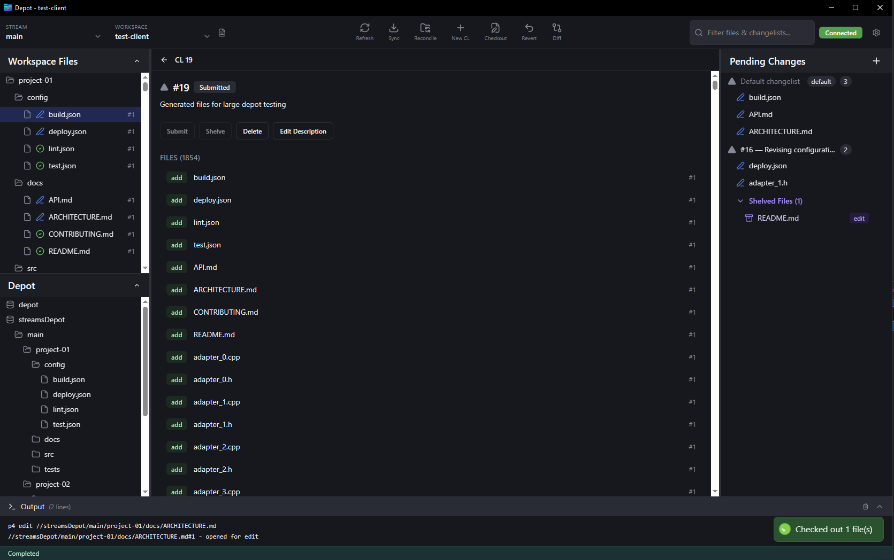

# Depot

A modern Windows GUI for Perforce, built for daily development work.

## Overview

Depot is a Windows GUI replacement for P4V designed around a core principle: **the user is never blocked**. Operations are cancellable, errors are non-blocking, and the app stays responsive even during network issues or long-running operations.

Built on Tauri 2.0 and React 19, Depot handles large workspaces with ease — progressive loading shows the first batch of files in under 500ms, instant fuzzy search works across 10,000+ files, and incremental updates avoid full tree rebuilds when only a few files change. The three-column layout (file tree, detail pane, changelists) and command palette provide efficient workflows without P4V's modal dialog traps.

## Alpha Disclaimer

> **Warning: Early Testing Software**
>
> This is v0.1.0 — expect bugs and missing features. Major functionality like branch/integrate operations, stream graph visualization, and time-lapse view are not yet implemented.
>
> Settings are stored in `%APPDATA%\com.depot.app`. If you encounter issues, please report them on GitHub.

## Quick Start

### Prerequisites

- Windows 10 or later
- Perforce Helix Core server (P4D) access
- `p4.exe` command-line client in PATH ([download from Perforce](https://www.perforce.com/downloads/helix-command-line-client-p4))

### Installation

1. Download the latest installer from [GitHub Releases](https://github.com/yourusername/depot/releases)
2. Run the installer (`.msi` or `.exe`)
3. If Windows SmartScreen shows a warning, see the section below

#### Windows SmartScreen Warning

Depot binaries are currently unsigned (no code signing certificate). Windows SmartScreen may block the first run with "Windows protected your PC."

**To bypass the warning:**
1. Click **More info**
2. Click **Run anyway**

This is safe — the source code is open and auditable on GitHub. Code signing will be considered post-v0.1 based on adoption.

### First Workflow

1. Launch Depot
2. Click **Connect** in the header
3. Enter your connection settings:
   - **P4PORT**: Your Perforce server address (e.g., `ssl:perforce.company.com:1666`)
   - **P4USER**: Your Perforce username
   - **P4CLIENT**: Your workspace/client name
4. Browse your workspace in the file tree
5. Check out files with right-click → **Check Out**
6. Make your changes in your editor
7. Submit with right-click → **Submit** or Ctrl+Enter

## P4V Comparison

| Feature | P4V | Depot |
|---------|-----|-------|
| **Startup Time** | 3-5 seconds | <1 second |
| **Large File Tree (10K+ files)** | Blocks UI, takes 10+ seconds | Progressive loading, <500ms first batch |
| **Search** | Modal dialog, no fuzzy match | Instant fuzzy search, <5ms |
| **Operations** | Blocking, freezes UI | Async, cancellable, non-blocking |
| **Error Handling** | Modal dialogs, workflow interruption | Inline errors, workflow continues |
| **UI Theme** | Light theme, dated UI | Modern dark theme |
| **Keyboard Shortcuts** | Limited | Command palette + extensive shortcuts |
| **Pending Changelists** | Available | Available |
| **File History** | Available | Available |
| **Diff Tool Integration** | Available | Available (external tool) |
| **Shelving** | Available | Available |
| **Reconcile** | Available | Available with preview |
| **Conflict Resolution** | Built-in merge tool | External merge tool (P4Merge, etc.) |
| **Branch/Integrate** | Available | Not yet implemented |
| **Stream Graph** | Available | Not yet implemented |
| **Time-Lapse View** | Available | Not yet implemented |
| **Admin Tools** | Available | Not yet implemented |

Depot focuses on daily development workflows with better performance and UX. For advanced operations like branching or admin tasks, P4V remains the recommended tool. Depot is designed as a complementary tool, not a complete replacement.

## Built with Claude

Built with [Claude](https://claude.ai) using the GSD (Get Shit Done) agentic methodology. Development history and planning artifacts are available in `.planning/` for those interested in the transparent, AI-assisted development process.

## License

MIT License - see [LICENSE](LICENSE) for details.
